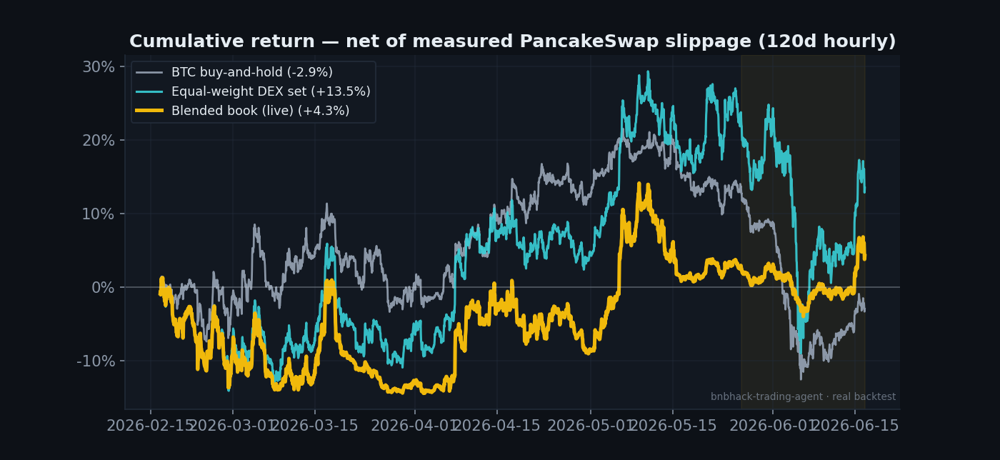
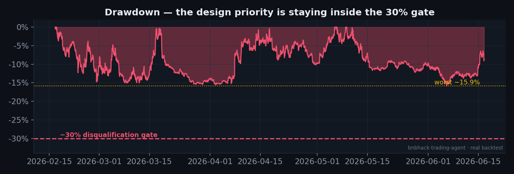
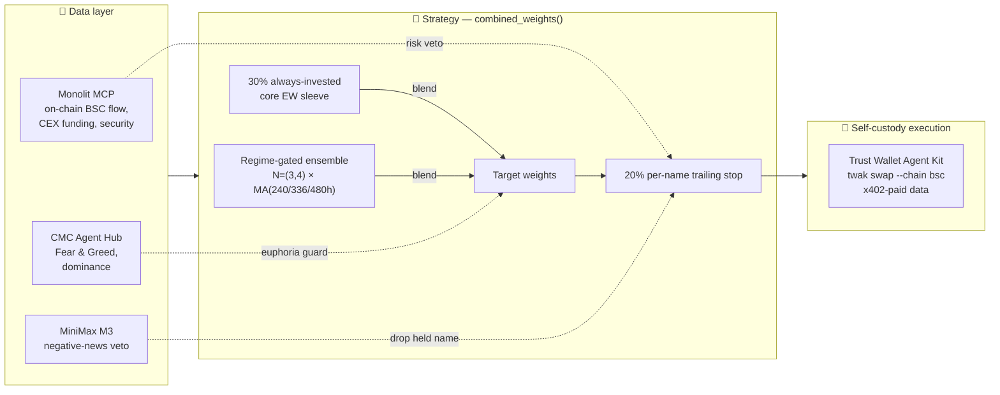
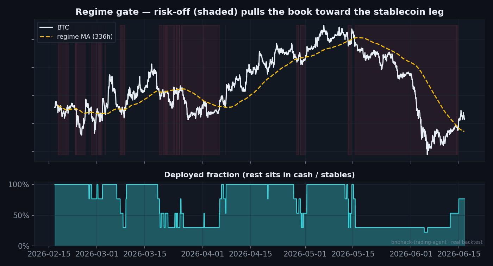
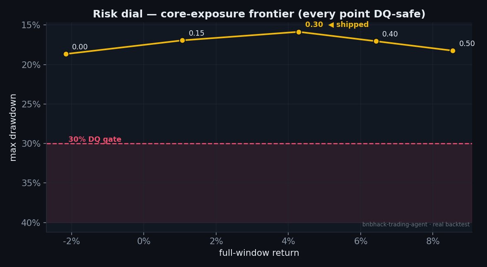
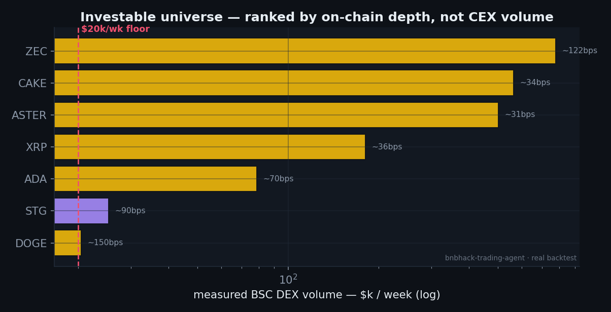
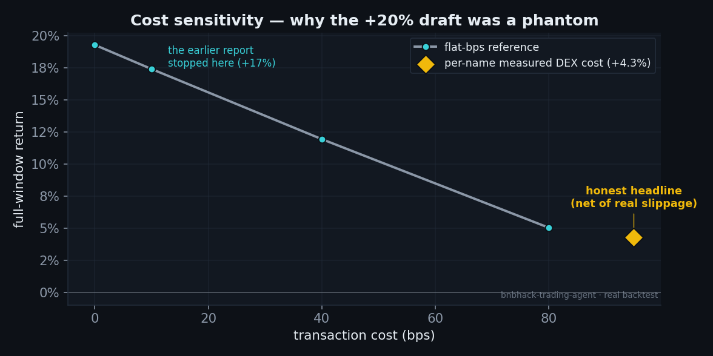
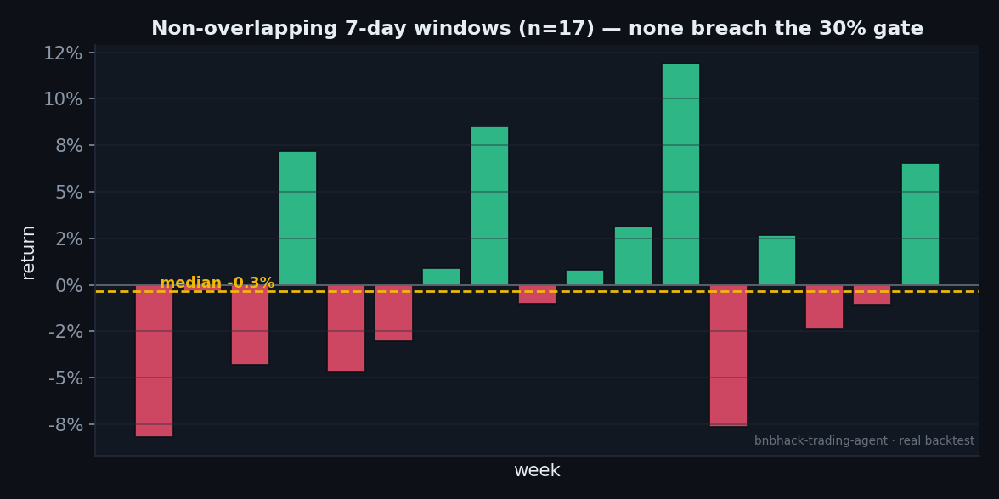

<div align="center">

# 🜲 Autonomous Self-Custody Trading Agent

### BNB Hack — AI Trading Agent Edition · **Track 1**

*A self-custodial agent that reads the market on an on-chain data layer most teams won't have,*
*decides allocation under hard risk rules, and signs every trade itself.*


**BNB Chain × CoinMarketCap × Trust Wallet** — competing for the PnL leaderboard **and** *Best Use of the Trust Wallet Agent Kit*.

</div>

---

## What it is

A fully autonomous agent that trades **spot, on-chain, in self-custody** over the Jun 22–28 window. It runs a 4-hour decision loop: read regime → size the book under hard risk caps → sign and execute every swap itself through the **Trust Wallet Agent Kit (TWAK)**, paying for its data keyless and per-request via **x402**. No human in the loop, no centralized exchange, no perps.

Its market-read brain runs on a crypto data layer most teams won't have: **Monolit** live on-chain BSC flow + CEX derivatives, layered on **CoinMarketCap's Agent Hub**, with a **MiniMax M3** negative-news veto.

> Full design spec: [`docs/superpowers/specs/2026-06-16-bnbhack-trading-agent-design.md`](docs/superpowers/specs/2026-06-16-bnbhack-trading-agent-design.md)

---

## Result — validated on 120 days of real hourly data

Net of **measured per-name PancakeSwap slippage** (the agent executes on a DEX, so this is the cost that matters), with a **locked 21-day holdout** never used to build the strategy.



| Strategy (live config) | Return | Sharpe | Max DD |
|---|---:|---:|---:|
| **DEX-liquid blended book — full window (realistic cost)** | **+4.3%** | 0.51 | **15.9%** |
| DEX-liquid blended book — locked 21d holdout | **+1.7%** | 1.19 | 7.0% |
| _(reference) same book @ optimistic 10 bps_ | +17.4% | — | — |
| Equal-weight (DEX-liquid set) baseline | +13.5% | 0.95 | 29.6% |
| BTC buy-and-hold | −2.9% | — | 28.0% |

The **design priority is not getting disqualified.** A 30% max-drawdown is an automatic DQ; this book's worst drawdown across 120 days is **15.9%** — wide headroom, held there by a per-name trailing stop and a regime gate.



---

## How the strategy works

The agent runs a **two-sleeve blended book**. One sleeve times the market and goes to cash when the regime turns; the other stays invested so the book always trades. Two circuit-breakers protect both.



### Sleeve 1 — regime-gated model-averaged ensemble

Equal-weight over basket sizes **N = 3 and 4** of the DEX-liquid set (per-name cap 0.34), averaged across three regime moving averages (**240 / 336 / 480h**). When BTC trades below its regime MA, that sleeve rotates to the **stablecoin leg** — it sits the downturn out in cash. Model-averaging across N and MA windows is the anti-overfit discipline: no single lookback is load-bearing.



The shaded bands are risk-off regime. The lower panel is the **deployed fraction** — watch it collapse toward the core floor during the early-June crash, exactly when BTC fell through its MA. That's the gate doing its job.

### Sleeve 2 — always-invested core (the risk dial)

A **30% equal-weight core** over the four deepest names, protected only by the trailing stop, **not** regime-gated. It captures the beta the binary gate sits out, and keeps the book trading every bar — so the contest's **≥1-trade/day** requirement is organic, no synthetic heartbeat needed.

The core fraction `core_ew_frac` is a smooth, **monotonic risk dial**, validated DQ-safe across its whole range. Every point on the frontier sits inside the 30% gate:



The shipped default **0.30** is the conservative pick — it earns *higher* full return **and** *lower* drawdown than the pure gate (0.00), because the two sleeves' drawdowns offset. Dial toward 0.50 for more upside in a trending week, at more drawdown.

### Two circuit-breakers

- **Regime hysteresis** — exit risk-off fast, re-enter only once BTC is back **above MA × 1.0075**. Stops the book whipsawing on noise around the moving average.
- **20% per-name trailing stop** — any held name that falls 20% from its 24h peak is dropped immediately, in both sleeves.

---

## The investable universe — ranked by on-chain depth, not CEX volume

The agent executes on **PancakeSwap**, so the universe is filtered by **measured BSC DEX depth**, not Binance volume. A full 59-token on-chain scan ([`scripts/scan_dex_liquidity.py`](scripts/scan_dex_liquidity.py)) leaves seven tradable names; the ensemble concentrates in the four deepest.



> **A red-team audit changed this result, and we kept the honest version.** An earlier draft ranked the basket by *Binance CEX* volume and assumed a flat 10 bps cost — reporting ~**+20%**. But re-measuring on-chain depth showed that book concentrated into names with almost no DEX liquidity; net of real slippage it would have hit **50%+ drawdown → automatic disqualification**. The fix: restrict to names with real BSC DEX depth (> $20k/wk) and price slippage **per name**. The reports are in [`docs/redteam/`](docs/redteam/).



The gap between the 10 bps line and the per-name diamond is exactly the cost the earlier report hid. The headline is also a **conservative floor**: it charges the price impact of a $200 trade, but a $500 book trades ~$125 per name — on an AMM, impact scales ~linearly with size, so realized cost is *lower* and live PnL is biased above the headline.

---

## Honest conclusion

Net of realistic DEX slippage, **no positive return-alpha survives in this universe** — consistent with the ~15 signal hypotheses (momentum, flow, whale-copy, funding, news-tilt, depeg, unlock, listing, squeeze, DEX/CEX lead-lag, LLM-allocator) tested across multi-agent rounds and **all rejected** under walk-forward + locked holdout + cost.



The **median week is ~flat**; the full-window figure compounds across a trending stretch, it is not a per-week promise. Returns are regime-dependent (sub-periods −15.9% / +19.8% / −2.9%). What's real is the **right-tail optionality** — a max 7-day window of +22.7%, P(week > 15%) ≈ 4% — and a book that **does not disqualify**.

So the leaderboard play is **convexity + survival**: a book that *can* post a >15% trending week while its drawdown stays well inside the 30% gate, plus bounded risk-control overlays (F&G euphoria guard, on-chain security veto, negative-news veto). Aggressive books that chase return will DQ; this one is built not to. The optional moonshot sleeve was tested and **defaults off** — it is a ~−1.9pp drag once slippage is real.

```bash
PYTHONPATH=src python3 -m bnbhack_agent.cli track1-backtest   # reproduce every number above
PYTHONPATH=src python3 scripts/make_charts.py                 # regenerate every chart above
```

---

## Architecture

| Module | Role |
|---|---|
| `strategy.py` | The blended book (`combined_weights`) — same function drives backtest **and** live (decision parity). |
| `universe.py` | DEX-liquid candidate set, ranked by measured on-chain depth (`dex_liquid_candidates`, `dex_cost_bps`). |
| `monolit.py` | Monolit MCP — on-chain BSC flow, CEX funding, token security. |
| `cmc.py` | CMC Agent Hub — Fear & Greed / dominance euphoria guard. |
| `news_veto.py` | MiniMax M3 via 0G — drops a held token on a fresh hack/exploit/depeg/delisting (validated on the STG −64% Coinbase-delisting crash). |
| `marketdata.py`, `portfolio.py`, `walkforward.py` | Cached price panels, no-lookahead simulator, walk-forward OOS + locked-holdout evaluation. |
| `execution.py` | Trust Wallet Agent Kit in self-custody — `twak swap --chain bsc`, x402-paid data, `serve --watch` unattended signing, risk caps gating every trade. |
| `agent.py` | The 4-hourly decision cycle (~74s) → risk-gated plan → self-custody execution → structured decision log. |
| `register.py` | BSC `CompetitionRegistry` registration (optional `web3` extra). |

All three partner signals (Monolit, CMC, M3) are **bounded, logged, best-effort overlays** off the hot path — they add *risk control*, never fabricated alpha, and never block the core decision.

> `cmc_skill.py` (a Track-2 Strategy Skill exporter) is carried over but is **not** part of this Track-1 submission.

---

## Usage

```bash
python3 -m pip install -e .                 # optionally: pip install 'web3>=6'  (on-chain registration)
python3 -m pytest -q                         # 77 passing

PYTHONPATH=src python3 -m bnbhack_agent.cli track1-backtest          # reproduce the OOS result
PYTHONPATH=src python3 -m bnbhack_agent.cli track1-run               # one decision cycle (dry-run)
MONOLIT_API_KEY=... PYTHONPATH=src python3 -m bnbhack_agent.cli track1-run --monolit   # with the live edge
PYTHONPATH=src python3 -m bnbhack_agent.cli track1-register          # registration window / status
```

API keys live in a **gitignored `.env`** (CMC, MiniMax M3 via 0G, Monolit). Copy `.env.example` to start. Never commit secrets.

---

## The contest, briefly

149 eligible BEP-20 tokens; portfolio valued in USD hour-by-hour; ranked by **% return** with simulated costs; **30% max-drawdown = disqualification**; **≥1 trade/day** required. Registration on the BSC `CompetitionRegistry` [`0x212c61b9b72c95d95bf29cf032f5e5635629aed5`](https://bscscan.com/address/0x212c61b9b72c95d95bf29cf032f5e5635629aed5) before the deadline; trading runs Jun 22–28. See [`docs/HACKATHON_RULES.md`](docs/HACKATHON_RULES.md).

## Disclaimer

Research and live-trading software. Not financial advice. Trades on-chain with real funds and can lose money.
